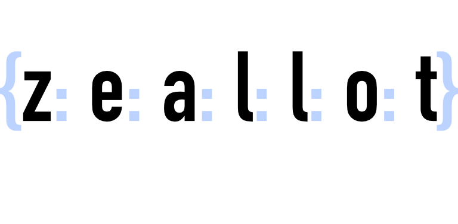

<h1 align="center">
</h1>

Variable assignment with zeal!

[travis]: https://travis-ci.org/nteetor/zeallot.svg?branch=master "shake and bake"
[appveyor]: https://ci.appveyor.com/api/projects/status/github/nteetor/zeallot?branch=master&svg=true "frappe!"
[coverage]: https://codecov.io/gh/nteetor/zeallot/branch/master/graph/badge.svg "deep fat fry"
[cran]: https://www.r-pkg.org/badges/version/zeallot "getting there"

![alt text][travis] ![alt text][appveyor] ![alt text][coverage] ![alt text][cran]

## What's to be excited about?

zeallot allows multiple or unpacking assignment in R. With zeallot you can 
tighten code with explicit variable names, unpack pieces of a lengthy list or 
the entirety of a small list, de-structure and assign object elements, or sample
all of these at once.

zeallot isn't pushed to CRAN yet, because we want your feedback. If you aren't 
familiar with downloading packages from GitHub (it's possible!) we'll quickly
touch on how to install zeallot.

### Installation

1. First make sure you have the *devtools* package installed,
```R
install.packages('devtools')
```

2. Next use the *devtools* function *install_github* to install this package,
```R 
devtools::install_github('nteetor/zeallot')
```

3. Make sure zeallot was successfully installed,
```R
isTRUE(require(zeallot))
#> TRUE, hopefully
```

## Getting Started

### A First Example

zeallot defines a `%<-%` operator to perform unpacking assignment. The operator 
expects a list, or nested list, of bare names on the left-hand side and a vector
or list of values on the right-hand side.

Because R won't allow us to separate our bare variable names using commas we use
colons instead.

```R
library(zeallot)

a: b %<-% c(0, 1)
a
#> 0
b
#> 1
```

If you are unfamiliar with multiple, parallel, or unpacking assignment, all we 
are doing is condensing multiple lines of variable assignments into a single
variable assignment line. Neat! If you are familiar, strickly speaking, zeallot
only implements unpacking assignment.

In that first example we unpacked a vector of values, if we want to unpack a
list of values we wrap our variable names with a set of braces, but otherwise
little else changes.

```R
{agenda: today} %<-% list('TODO: ..', Sys.Date())
```

In the above example we save today's date to `today`. With a little elbow
grease, we can extract the year, month, and day from the `today` variable.

```R
{agenda: today} %<-% list('TODO: ..', Sys.Date())
year: month: day %<-% strsplit(format(today, '%Y~%m~%d'), '~')[[1]]
```

We have the year, month, and date, but using de-structuring we can avoid some of
the overhead. The `%<-%` operator will take our Date object and de-structure it 
into a list of three elements, year, month, and day.

```R
year: month: day %<-% today
```

And if we didn't need the year value we could skip it using the special name,
`.`.

```R
.: month: day %<-% today
```

`%<-%` de-structures the Date object because there were three variable names on 
the left-hand side of the operator; three variable names for the three
de-structured elements. If we specified two or four names, we would get an
error.

```R
year: month %<-% today
#> Error: too many values to unpack

year: month: day: hours %<-% today
#> Error: expecting 4 values, but found 3
```

Date objects (and other obejcts) are not always de-structured. A list of Date
objects is still a list of values we can assign to individual names.

```R
{today: tomorrow} %<-% list(Sys.Date(), Sys.Date() + 1)
```

### Nested Values

In reality we know we are not always dealing with flat lists. Fortunately, we
can unpack nested values by nesting our variable names.

```R
{{a: b}: {c: d}} %<-% list(list(1, 2), list(3, 4))
a
#> 1
b
#> 2
c
#> 3
d
#> 4
```

So long as the structure of the variable names mimic the structure of the
values, we can unpack values at any depth.

We could also choose to save the entire first tuple and only unpack the values
of the second tuple.

```R
{a: {b: c}} %<-% list(list(1, 2), list(3, 4))
a
#> list(1, 2)
b
#> 3
c
#> 4
```

### Much, Much More!

This is where I will conclude the README for now.

## Package Vignette

If you are intrigued by any of what is above I highly suggest you read through 
the [introductory vignette](vignettes/packing-assignment.Rmd). This README hopes
to get your attention, but the vignette focuses on walking you through and 
teaching you all of zeallot.

---

Inspiration for this package goes to Paul Teetor.

Without his encouragement nothing would have gotten off the ground.
